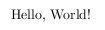

LaTeX
=====

Introduction
------------
LaTeX is a typesetting program used to produce excellently typeset documents. It is extensively used for producing high quality scientific and mathematical documents. It may also be used for producing other kinds of documents, ranging from simple one page articles or letters 


TeX & LaTeX
~~~~~~~~~~~

TeX
+++

TeX is a typesetting system designed by Donald Knuth, the renowned Computer Scientist and Emeritus professor at Stanford University. Typesetting is placing text onto a page with all the style formatting defined, so that content looks as intended. 

It was designed with two goals in mind-

1. To allow anybody to produce high-quality books using a reasonable amount of effort. 
2. To provide a system that would give the exact same results on all computers, now and in the future

TeX is well known for it's stability and portability. 

TeX is pronounced as "tech".

The current version of TeX is 3.1415926 and is converging to π.

LaTeX
+++++

LaTeX was originally written by Leslie Lamport in the early 1980s. It is an extension of TeX, consisting of TeX macros and a program to parse the LaTeX files. It is easier to use than TeX itself, at the same time producing the same quality of output. 

LaTeX is pronounced either as "Lah-tech" or "Lay-tech"

WYSIWG vs. WYSIWM
~~~~~~~~~~~~~~~~~

WYSIWG is an acronym for "What You See Is What You Get". Word processors, are typically WYSIWG tools. LaTeX, TeX or other TeX based tools are not. They are typesetting or text formatting or document description programs. They can be called WYSIWM or "What You See Is What you Mean" systems, since you give a description of how things look, and LaTeX typesets the document for you.

Here are a few reasons, why you should use LaTeX -

  * LaTeX produces documents with excellent visual quality, especially mathematical and scientific documents. 
  * It does the typesetting to you. Typically, when one works with a word-processor, the user is doing the text formatting or typesetting along with typing out the content. LaTeX allows the user to concentrate on the content leaving aside the typesetting to LaTeX. 
  * It is light on your resources as compared to most of the word processors available today. 
  * It is well known for it's stability and for it's virtually bug free code base. 
  * It encourages users to structure documents by meaning rather than appearance, thereby helping produce well structured documents. 
  * It uses plain text files as input, which have a lot of well known advantages over binary files. To state a few, they can be opened with any editor on any operating system, they are smaller in size compared to the binaries, can be version controlled and can be processed using widely used text processing utilities. 
  * The output can be generated in more than one formats.
  * It is free software (free as in freedom) and gratis too.
  * It is widely used.

Hello World
~~~~~~~~~~~

OK, let's get started with our first LaTeX document. Open up your favorite editor and type in the following code. 

::

  %hello.tex - First LaTeX document
  \documentclass{article}

  \begin{document}
    Hello, World!
  \end{document}

Save the file as ``hello.tex`` and open up a terminal to compile your ``tex`` file to get the output in a ``pdf`` format. 

Compiling & Output
++++++++++++++++++

::

  $pdflatex hello.tex

  Output written on hello.pdf (1 page, 5733 bytes).
  Transcript written on hello.log.

Open the ``hello.pdf`` to see the output as shown. 



Note: The command ``latex`` is often used to get the ``dvi`` output. But, throughout this course, we shall use pdflatex to compile our documents. 

A peek at the source
++++++++++++++++++++

``%hello.tex - First LaTeX document``

  This line is a comment. LaTeX ignores this line and it is meant only for the human readers. LaTeX ignores anything after a ``%`` symbol to the end of the line. 

``\documentclass{article}``

  This line is a command and sets the ``documentclass`` of the document to ``article``. LaTeX has other classes like ``report``, ``book``, ``letter``, etc. The typesetting of the document varies depending on the ``documentclass`` of the document. 


``\begin{document}``

  This line informs LaTeX that this is the beginning of the content of the document. 

``Hello, World!``

  This is the actual text displayed in the document. 

``\end{document}``

  This line tells LaTeX that the document is complete and LaTeX will simply ignore anything written after this line.

Where do we want to go
~~~~~~~~~~~~~~~~~~~~~~

During the course of this session we will learn how to do various things in LaTeX and try to produce the sample document provided. 

Some Basics
~~~~~~~~~~~
Before we get started with creating the document, let's try to understand a few things that would be useful during the course of this session. 

Spaces
++++++

LaTeX treats multiple empty spaces (or lines) as a single space (or line). An empty line between two lines of text is considered as a change of paragraphs. 

Line & Page Breaks
++++++++++++++++++

LaTeX usually does the job of breaking up your content into lines and pages, and does it well. But under some circumstances, you might want to instruct LaTeX to break line or start a new page at a particular point. 

``\\`` or ``\newline`` command is used to create a new line at the point where the command is issued. 
Appending ``*`` to ``\\``,  instructs LaTeX to create a new line, without creating a new page at that point. 

Paragraphs
++++++++++

As already mentioned, LaTeX considers an empty line between two lines of text as a new paragraph. ``\par`` command may also be used to start a newline. It is equivalent to the blank line. 

By default LaTeX indents new paragraphs. If you do not wish to have the paragraph indented, you can use the ``\nointend`` command at the beginning of the paragraph. 

Special Characters
++++++++++++++++++

LaTeX associates special meaning to the  characters ``~ # $ % ^ & _ { } \``. 

To have these characters in the text of your document, you need to prefix a backslash to them. ``\~ \# \% \$ \^ \& \_ \{ \} \textbackslash``


Commands
++++++++

* All LaTeX commands start with a backslash ``\``.
* Like the commands in Linux, they are case sensitive.
* They usually have a backslash followed by a consisting of letters only. Any character other than letters, like space, numbers or special characters terminate the command. 
* The commands for producing special characters in the text, is an exception. They contain a backslash followed by a single special character.
* Commands may have parameters, which are supplied to them by enclosing them in curly braces ``{ }``.
* They may also have a few optional parameters which are added after the name in square brackets ``[ ]``.


Environments
++++++++++++

Environments are very similar to the commands, except that they effect larger parts of the document. For example, we used the ``document`` environment in our first LaTeX document. 

* They begin with a ``\begin`` and end with a ``\end``
* In general environments can be nested within each other. 

Some Structural Elements
------------------------

``\documentclass``
~~~~~~~~~~~~~~~~~~
As already stated, the ``documentclass`` command tells LaTeX, the type of the document that you intend to create. Each class has a few differences in how the content of the document is typeset. We presently have it set to the article class. Let us try changing it to the report class. 

Note that the top matter of the document appears in a different page for the report class. 

Some of the LaTeX classes that you may want to use are, article, proc, report, book, slides, letter. 

The ``documentclass`` command also accepts a few optional parameters. For example::
  \documentclass[12pt,a4paper,oneside,draft]{report}

``12pt`` specifies the size of the main font in the document. The relative sizes of the various fonts is maintained, when the font size is changed. If no size is specified, ``10pt`` is assumed by default. 

``a4paper`` specifies the size of the paper to be used for the document. 

``oneside`` specifies that the document will be printed only on one side of the paper. The ``article`` and ``report`` classes are ``oneside`` by default and the ``book`` class is ``twoside``.

``draft`` marks the hyphenation and justification problems in the document with a small square in the right hand margin of the document, so that they can be easily spotted. 

Note: Everything written in between the ``\documentclass`` command and the ``\begin{document}`` command is called the Preamble. 


Parts, Chapters and Sections
~~~~~~~~~~~~~~~~~~~~~~~~~~~~

Often documents are divided into various parts, chapters, sections and subsections. LaTeX provides an intuitive mechanism to include this in your documents. It has various commands like ``part``, ``chapter``, ``section``, ``subsection``, ``subsubsection``, ``paragraph`` and ``subparagraph``. Note that all these commands are not available in all the document classes. The ``chapter`` command is available only in books and reports. Also, the ``letter`` document class does not have any of these commands. 

Let us now give our document some structure, using these commands. 

Note that you do not need to provide any numbers to the commands. LaTeX automatically takes care of the numbering. 
Also, you do not need to enclose the text of a block within ``\begin`` and ``\end`` commands. LaTeX starts a new block each time it finds a sectioning command. 
::

  \section[Short Title]{This is a very long title and the Short Title will appear in the Table of Contents.}


Section Numbering
+++++++++++++++++

As already, you don't need to explicitly do any numbering in LaTeX. Parts are numbered using roman numerals; Chapters and sections are numbered using decimal numbers. When the table of contents is inserted into a document, all the numbered headings automatically appear in it.

By default LaTeX has numbering up 2 levels, i.e, the parts, chapters, sections and subsections are numbered. You can change this by setting the ``secnumdepth`` counter using the ``\setcounter`` command. The following command removes numbering of the subsections. Only parts, chapters and sections are numbered. 
::

  \setcounter{secnumdepth}{1}

A sectioning command appended with an asterisk gives an unnumbered heading that is not included in the table of contents.
::

  \section*{Introduction}

Top Matter
~~~~~~~~~~

The information about the document such as it's title, the date, the author(s) information etc, is collectively known as the topmatter. Though there is no command called ``topmatter``, the term topmatter is frequently used in LaTeX documentation. 

Let us input the top matter for our document now. 
::

  \title{LaTeX - A How-to}
  \author{The FOSSEE Team}
  \date

The  commands ``\title`` and  ``\author`` are self explanatory. 
The ``\date`` command automatically puts in today's date into the document. Now let us compile and look at the result. 

You would observe that the details do not appear in the document after recompilation. This is because, LaTeX has not been instructed what to do with the top matter information that you have given it. Use the ``\maketitle`` command within the document environment to instruct LaTeX to place the top matter information into the document. 

Abstract
~~~~~~~~
Lets now place and abstract in the document using the ``abstract`` environment of LaTeX. The abstract appears in the document after the topmatter but before the main body of the document. 
::

  \begin{abstract}
  The abstract abstract.
  \end{abstract}


Appendices
~~~~~~~~~~

LaTeX allows for separate numbering for appendices. ``\appendix`` command indicates that the sections following are to be included in the appendix. 
::

  \appendix
  \chapter{First Appendix}

Table of Contents
~~~~~~~~~~~~~~~~~

Parts, chapters or sections that have been auto numbered by LaTeX automatically appear in the Table of Contents (ToC). ``\tableofcontents`` command places a the ToC, where the command has been issued. 

The counter ``tocdepth`` specifies the depth up to which headings appear in the ToC. It can be set using the ``\setcounter`` command as shown below. 
::

  \setcounter{tocdepth}{3}

Unnumbered sections can be placed in the table of contents using the ``\addcontentsline`` command as shown below.
::

  \section*{Introduction}
  \addcontentsline{toc}{section}{Introduction}

Note: To get the correct entries in your table of contents, you will need to run one extra compilation, each time. This is because, the entries of the table of contents are collected during each compilation of the document and utilized during the next compilation. 

Elementary Text Typesetting
---------------------------

Emphasizing
~~~~~~~~~~~

*Italic* font is generally used to emphasize text. The ``\emph`` command may be used to achieve this effect in LaTeX.
::

  This is the \emph{emphasized text}.

If the ``\emph`` command is nested within another emphasize command, LaTeX emphasized that text using normal fonts. 
::

  \emph{Did you wonder what happens when we try \emph{emphasizing text} within \emph{emphasized text}}?

*This is emphasized text, and* this is emphasized text with normal font *, within* emphasized text.

Quotation Marks
~~~~~~~~~~~~~~~

When typing in LaTeX, the double quotation mark ``"`` character shouldn't be used. The grave accent ````` character produces the left quote and the apostrophe ``'`` character produces the right quote. To obtain double quotes they are, each, used twice. 
::

  `` Here is an example of putting `text' in quotes ''

Dashes and Hyphens
~~~~~~~~~~~~~~~~~~

LaTeX has four dashes of different lengths. Three of them can be produces with different number of consecutive dashes. The short dashes are used for hyphens, slightly longer ones for number ranges and the longest ones for comments. The fourth one is a mathematical symbol, the minus sign. 
::

  The names of these dashes are: `-' hyphen, `--' en-dash, `---' em-dash and `$-$' minus sign.

The names for these dashes are: ‘‐’ hyphen, ‘–’ en-dash, ‘—’ em-dash and ‘−’ minus sign.

Footnotes
~~~~~~~~~

With the command::

  \footnote{footnote text}

a footnote is printed at the foot of the current page. Footnotes should always be put after the word or sentence they refer to. Footnotes referring to a sentence or part of it should therefore be put after the comma or period.

Note: Look at the ``\marginpar`` command to insert margin notes

Flushleft, Flushright, and Center
~~~~~~~~~~~~~~~~~~~~~~~~~~~~~~~~~

The environments ``flushleft`` and ``flushright`` generate paragraphs that are either left- or right-aligned. 

The ``center`` environment generates centered text.

Itemize, Enumerate, and Description
~~~~~~~~~~~~~~~~~~~~~~~~~~~~~~~~~~~
LaTeX has three different environments for producing lists. Itemize, Enumerate and Description allow you to produce lists of various types in LaTeX. 

Itemize is used to produce unnumbered lists. The bullets of the list can be easily changed to use any character. Enumerate environment allows you to produce auto-numbered lists. The description environment, allows you to produce a list of definitions. These environments can be nested within each other, easily. 

::

  \begin{itemize}
    \item Now we move onto some elementary \emph{Text Typesetting}.
    \item How do we get \emph{emphasized or italic text}?
    \item \emph{Did you wonder what happens when we try \emph{emphasizing text} within \emph{emphasized text}}?
    \item ``Beautiful is better than ugly.''
  \end{itemize}
  
  \begin{description}
    \item[Description] This list is a description list. 
    \item[Enumerate] Numbered lists are often useful.
      \begin{enumerate}
      \item First
      \item Second
      \item Third
      \item \ldots
      \end{enumerate}
    \item[Itemize] The list above this description list is an itemize list.
  \end{description}
  
Quote, Quotation, and Verse
~~~~~~~~~~~~~~~~~~~~~~~~~~~

LaTeX provides a ``quote`` environment that can be used for quoting, highlighting important material, etc. 
::

  The Zen of Python
  \begin{quote}
    The Zen of Python, by Tim Peters
    
    Beautiful is better than ugly.
    Explicit is better than implicit.
    Simple is better than complex.
    Complex is better than complicated.
    Flat is better than nested.
    Sparse is better than dense.
    Readability counts.
    Special cases aren't special enough to break the rules.
    Although practicality beats purity.
    Errors should never pass silently.
    Unless explicitly silenced.
    In the face of ambiguity, refuse the temptation to guess.
    There should be one-- and preferably only one --obvious way to do it.
    Although that way may not be obvious at first unless you're Dutch.
    Now is better than never.
    Although never is often better than *right* now.
    If the implementation is hard to explain, it's a bad idea.
    If the implementation is easy to explain, it may be a good idea.
    Namespaces are one honking great idea -- let's do more of those!
  \end{quote}

LaTeX provides two other similar environments, the quotation and the verse environments. 

The quotation environment can be used for longer quotes which have several paragraphs, since it indents the first line of each paragraph. 

The verse environment may be used to quote verses or poems, since the line breaks are important in quoting them. The lines are separated using ``\\\\`` at the end of a line and an empty line after each verse. 

Verbatim
~~~~~~~~
The verbatim environment allows us to insert pre-formatted text in a LaTeX document. It is useful for inserting code samples within the document. The verbatim text needs to be enclosed between ``\begin{verbatim}`` and ``\end{verbatim}``. 
::

  \begin{verbatim}
  from numpy import *
  a = linspace(0, 5, 50, endpoint = False)
  \end{verbatim}

  from numpy import *
  a = linspace(0, 5, 50, endpoint = False)

To insert verbatim text in-line, the ``\verb`` command can be used. 
::
  
 The verb command allows placing \verb|verbatim text| in-line. 

The | is just an example of a delimiter character. You can use any character except letters, * or space.

Tables, Figures and Captions
----------------------------

The ``\tabular`` environment
~~~~~~~~~~~~~~~~~~~~~~~~~~~~

The ``tabular`` environment allows you to typeset tables in LaTeX. ``\begin{tabular}[pos]{col fmt}`` command can be used to specify the parameters of the table and start creating the table. 

The ``pos`` argument specifies the vertical position of the table relative to the baseline of the surrounding text. It can take on the values ``t`` for top, ``b`` for bottom, or ``c`` for center. 


The ``col fmt`` argument specifies the formatting of the columns of the table. You need to explicitly specify the formatting for each of the columns in the table. The ``col fmt`` argument can take on the following values. 

+---------------+------------------------------------+
| ``l``         | left justified column content      |
+---------------+------------------------------------+
| ``r``         | right justified column content     |
+---------------+------------------------------------+
| ``c``         | centered column content            |
+---------------+------------------------------------+
| ``*{n}{col}`` | produces ``n`` columns with the    |
|               | ``col`` type of formatting         |
|               | ``*{3}{c}`` is the same as {c c c} |
+---------------+------------------------------------+
| ``|``         | produces a vertical line.          |
+---------------+------------------------------------+

Now we look at how to input the actual entries of the tables. Each horizontal row in a table is separated by ``\\``. Each column entry of a row is separated by ``&``. 

The ``\hline`` command allows you to draw horizontal lines between two rows of the table. But it does not allow you do draw partial lines. ``\cline{a-b}`` draws a horizontal line from column ``a`` to column ``b``.
::

  \begin{tabular}{|c|c|}
    \hline
    \verb+l+ & left justified column content\\ 
    \hline
    \verb+r+ & right justified column content\\ 
    \hline
    \verb+c+ & centered column content\\ 
    \hline
    \verb+*{n}{col}+ & produces \verb+n+ columns with the\\
                   & \verb+col+ type of formatting\\
    \cline{2-2}
                   &\verb+*{3}{c}+ is the same as \verb+{c c c}+ \\
    \hline
    \verb+|+ & produces a vertical line\\ 
    \hline
  \end{tabular}

Importing Graphics
~~~~~~~~~~~~~~~~~~

To include images in LaTeX, we require to use an additional package known as ``graphicx``.  To load a package, we use the ``\usepackage`` directive in the preamble of the document.
::

  \usepackage{graphicx}

When compiling with ``pdflatex`` command,  **jpg**, **png**, **gif** and **pdf** images can be inserted. 

::

  \includegraphics[optional arguments]{imagename}

A few ``optional arguments``:

  ``width=x``, ``height=x``
    If only the height or width is specified, the image is scaled, maintaining the aspect ratio.

  ``keepaspectratio``
    This parameter can either be set to true or false. When set to true, the image is scaled according to both width and height, without changing the aspect ratio, so that it does not exceed both the width and the height dimensions. 

  ``scale=x``
    Scale the image by a factor of ``x``. For example, ``scale=2``, will double the image size. 

  ``angle=x``
    This option can be used to rotate the image by ``x`` degrees, counter-clockwise. 

::

  \includegraphics[scale=0.8, angle=30]{lion_orig.png}

Floats
~~~~~~

Tables and Figures need to be treated in a special manner, since they cannot be split over pages, and they are referred to as floats in LaTeX. 

When there is not enough space on a page, to fit in a table or figure, it is floated over to the next page filling up the current page with text. LaTeX has float environments called table and figure for tables and images, respectively.

Anything enclosed within the table or figure environments will be treated as floats.
::

  \begin{figure}[pos] or 
  \begin{table}[pos]

The ``pos`` parameter specifies the placement of the float. The possible values it can take are as follows. 

+-----------+-------------------------------------------------------------------+
| Specifier | Permission                                                        |
+===========+===================================================================+
|   h       |  at approximately the same place where it occurs in the source    |
+-----------+-------------------------------------------------------------------+
|   t       |  at the top of the page.                                          |
+-----------+-------------------------------------------------------------------+
|   b       |  at the bottom of the page.                                       |
+-----------+-------------------------------------------------------------------+
|   p       |  on a special page for floats only.                               |
+-----------+-------------------------------------------------------------------+
|   !       |  Override LaTeX's internal parameters for good positions          |
+-----------+-------------------------------------------------------------------+
|   H       |  nearly equivalent to h!                                          |
+-----------+-------------------------------------------------------------------+

Examples::

  \begin{figure}[h]
  \centering
  \includegraphics[scale=0.8, angle=30]{lion_orig.png}
  \end{figure}


Captions
~~~~~~~~

The ``\caption{text}`` command allows you to add captions to images or tables. LaTeX automatically numbers your tables and figures and you need not include numbers in the captions that you write. The caption appears below or on top of the image (or table), depending on whether you place it after or before the ``importgraphics`` (or ``tabular``) command. 

::
  \begin{figure}[h]
  \centering
  \includegraphics[scale=0.8]{lion_orig.png}
  \caption{CTAN lion drawing by Duane Bibby; thanks to www.ctan.org}
  \end{figure}

The caption command also, like the section command, has the short caption optional parameter. The short caption will appear in the list of tables or figures. 

List of Figures, Tables
~~~~~~~~~~~~~~~~~~~~~~~

LaTeX can automatically generate a List of Tables or Figures, with the table or figure numbers, the captions and page numbers on which they appear. This can be done using the ``\listoftables`` or ``listoffigures`` commands. 

Note: Just like table of contents, these lists also require an extra compilation. 

Cross References
~~~~~~~~~~~~~~~~

LaTeX has a very efficient mechanism of inserting cross-references in documents. 

The command ``\label{name}`` is used to label figures, tables or segments of text. ``\ref{name}`` refers to the object marked by the ``name`` by it's numbering (figure, table, section etc.) ``\pageref{name}`` gives the page number of the object which has been labeled with ``name``. 

Note: Cross referencing also requires an extra compilation, like table of contents. 

Bibliography
------------

Bibliography or references can be added to LaTeX documents in two ways - using the ``thebibliography`` environment, or using BibTeX. Let's first look at using the ``\thebibliography`` environment and then move on to BibTeX.

``thebibliography`` environment
~~~~~~~~~~~~~~~~~~~~~~~~~~~~~~~

Writing bibliographies in LaTeX using the ``thebibliography`` environment is pretty easy. You simply have to list down all the bibliography items within the bibliography environment. 

Each entry of the bibliography begins with the command ``\bibitem[label]{name}``. The name is used to cite the bibliography item within the document using  ``\cite{name}``. The label option replaces the numbers from the auto enumeration with the labels given. 
::

  He used this lion in the illustrations for D Knuth's original TeXbook\cite{DKnuth}, for L Lamport's LaTeX book\cite{LLamport}

  \begin{thebibliography}{99}
    \bibitem{DKnuth} Donald E. Knuth (1984). \emph{The TeXbook} (Computers and Typesetting, Volume A). Reading, Massachusetts: Addison-Wesley. ISBN 0-201-13448-9.
  
    \bibitem{LLamport} Lamport, Leslie (1994). \emph{LaTeX: A document preparation system: User's guide and reference}.
     illustrations by Duane Bibby (2nd ed.). Reading, Mass: Addison-Wesley Professional. 
  \end{thebibliography}

The ``99`` in the example above indicates the maximum width of the label that the references may get. We here assume that the number of Bibliography items will be less than 100. If your document has less than 10 references, you may want to replace ``99`` with ``9``. 

BibTeX
~~~~~~

The previous section explained the process of listing references at the end of a document and embedding cross references. In this section let us explore the BibTeX environment for keeping track of references.

Using BibTeX is a very convenient method to use, when writing multiple documents in a single area or field. BibTeX allows you to create a database of all your references and use them as and when required. 

The BibTeX database is stored in a ``.bib`` file. The structure of the file is quite simple and an example is shown below. 
::

  @book{Lamport94,
  author    = "Leslie Lamport",
  title     = "A Document Preparation System: User's Guide and Reference",
  publisher = "Addison-Wesley Professional",
  year      = "1994",
  edition    = "second",
  note      = "illustrations by Duane Bibby"
  }

Each bibliography entry starts with a declaration of the type of the reference being mentioned. The reference is in the above example is of the book type. BibTeX has a wide range of reference types, for example, ``article, book, conference, manual, proceedings, unpublished``.

The type of reference is followed by a left curly brace, and immediately followed by the citation key. The citation key, ``Lamport94`` in the example above is used to cite this reference using the command ``\cite{Lamport94}``. 

This is followed by the relevant fields and their values, listed one by one. Each entry must be followed by a comma to delimit one field from the other. 

To get your LaTeX document to use the bibliography database, you just add the following lines to your LaTeX document. 
::

  \bibliographystyle{plain}
  \bibliography{LaTeX}

Bibliography styles are files that tell BibTeX how to format the information stored in the ``.bib`` database file. The style file for this example is ``plain.bst``. Note that you do not need to add the ``.bst`` extension to the filename.  If you wish to achieve a particular style of listing the bibliography items and citing them, you should use an appropriate style file. 

The ``bibliography`` command specifies the file that should be used as the database for references. The file used in this example is ``LaTeX.bib``

Compiling
+++++++++

Adding BibTeX based references, slightly complicates the process of compiling the document to obtain the desired output. The exact workings of LaTeX and BibTeX will not be explained here. The procedure for obtaining the output (without any explanations) is as follows:

1. Compile the ``.tex`` file using ``pdflatex`` - ``$pdflatex LaTeX(.tex)``
2. Compile the ``.bib`` file using ``bibtex`` -  ``$bibtex LaTeX(.bib)``
3. Compile the ``.tex`` file again. 
4. Compile the ``.tex`` file for one last time!

Typesetting Math
----------------

It is advisable to use the AMS-LaTeX bundle to typeset mathematics in LaTeX. It is a collection of packages and classes for mathematical typesetting. 

We load ``amsmath`` by issuing the ``\usepackage{amsmath}`` in the preamble. Through out this section, it is assumed that the ``amsmath`` package has been loaded. 


Math Mode
~~~~~~~~~

There are a few differences between the *math mode* and the *text mode*:

1. Most spaces and line breaks do not have any significance, as all spaces are either derived logically from the mathematical expressions, or have to be specified with special commands such as ``\``, ``\quad`` or ``\qquad``

2. Empty lines are not allowed.  

3. Each letter is considered to be the name of a variable and will be typeset as such. If you want to typeset normal text within a formula, then you have to enter the text using the \text{...} command

Single Equations
~~~~~~~~~~~~~~~~

Mathematical equations can be inserted in-line within a paragraph (*text style*), or the paragraph can be broken to typeset it separately (*display style*). 

A mathematical equation within a paragraph is entered between ``$`` and ``$``. Larger equations are set apart from the paragraph, by enclosing them within ``\begin{equation}`` and ``\end{equation}``. If you don't wish to number a particular equation, the starred version of equation can be used. ``\begin{equation*}`` and ``\end{equation*}``

The equation can also be cross referenced using the ``\label`` and ``\eqref`` commands. 

Basic Elements
~~~~~~~~~~~~~~

Greek Letters can are entered as ``\alpha, \beta, \gamma, \delta, ...`` for lowercase letters and ``\Alpha, \Beta, \Gamma, ...`` for uppercase ones. 

Exponents and subscripts can be typeset using the carat ``^`` and the underscore ``_`` respectively. Most of the math mode commands act only on the next character. If you want a command to affect several characters, they need to be enclosed in curly braces. 

The ``\sqrt`` command is used to typeset the square root symbol. LaTeX of the root sign is determined automatically. The nth root is generated with ``\sqrt[n]``. 

To explicitly show a multiplication a dot may be shown. ``\cdot`` could be used, which typesets the dot to the center. ``\cdots`` is three centered dots while ``\ldots`` sets the dots on the baseline. Besides that ``\vdots`` for vertical and ``\ddots`` can be used for diagonal dots.

A fraction can be typeset with the command ``\frac{..}{..}``

The integral operator is generated with ``\int``, the sum operator with ``\sum``, and the product operator with ``\prod``. The upper and lower limits are specified with ``^`` and ``_`` like subscripts and superscripts.

LaTeX provides all kinds of braces as delimiters. The round and square brackets can be produces using the keys on the keyboard and appending a backslash. Other delimiters can be produced using special commands of LaTeX. Placing ``\left`` in front of an opening delimiter and ``\right`` in front of a closing delimiter, instructs LaTeX to automatically take care of the sizes of the delimiters. 

Multiple Equations
~~~~~~~~~~~~~~~~~~

Long formulae that run over several lines or equation systems, can be typeset using the ``align`` or ``align*`` environments. ``align`` numbers each of the lines in the environment, and ``align*`` as expected, does not number any of them. 

The ``&`` is used to align the equations vertically and the ``\\`` command is used to break the lines. Line numbering can be skipped for a particular line in the ``align`` environment by placing a ``\nonumber`` before the line break.

::

  \begin{align}
  \alpha^2 + \beta^2 &= \gamma^2 \\
  \sum_{i=1}^ni &= \frac{n(n+1)}{2}\\
  \sqrt{-1} &= \pm1 \nonumber
  \end{align}


Arrays and Matrices
~~~~~~~~~~~~~~~~~~~

To typeset arrays, use the ``array`` environment. It works similar to the ``tabular`` environment. The ``\\`` command is used to break the lines. 
::

  \begin{equation*}
  \mathbf{X} = \left(
   \begin{array}{ccc}
   a_1 & a_2 & \ldots \\
   b_1 & b_2 & \ldots \\
   \vdots & \vdots & \ddots
   \end{array} \right)
  \end{equation*}

The ``array`` environment can also be used to typeset piecewise functions by using a “.” as an invisible ``\right`` delimiter
::

  \begin{equation*}
  f(x) = \left\{
   \begin{array}{rl}
     0 & \text{if } x \le 0\\
     1 & \text{if } x > 0
   \end{array} \right.
   \end{equation*}

Six different types of matrix environments are available in the ``amsmath`` package for typesetting matrices.  They essentially have different delimiters: ``matrix`` (none), ``pmatrix`` (, ``bmatrix`` [, ``Bmatrix`` {, ``vmatrix`` | and ``Vmatrix`` ‖. In these matrix environments, the number of columns need not be specified, unlike the ``array`` environment.
::

  \begin{equation*}
    \begin{matrix}
    1 & 2 \\
    3 & 4
    \end{matrix} \qquad
 
    \begin{bmatrix}
    1 & 2 & 3 \\
    4 & 5 & 6 \\
    7 & 8 & 9
    \end{bmatrix}
  \end{equation*}

Miscellaneous Stuff
-------------------

Presentations
~~~~~~~~~~~~~

LaTeX has quite a few options to produce presentation slides. We shall look at the ``beamer`` class, which is well developed and easy to use. We shall only briefly look at some of the features of beamer. For the best documentation, look at the beamer user guide.

To write a ``beamer`` presentation, it is recommended that you use one of the templates that beamer provides. We shall use the ``speaker_introduction`` template to get started with beamer. 

As you can see, the document begins with the ``documentclass`` being set to beamer. 

The ``\setbeamertemplate`` command sets the template for various parameters. The ``background canvas``, ``headline`` and ``footline`` are being set using the command.

``\usetheme`` command sets the theme to be used in the presentation. 

Notice that each slide is enclosed within ``\begin{frame}`` and ``\end{frame}`` commands. The ``\begin{frame}`` command can be passed the Title and Subtitle of the slide as parameters. 

To achieve more with beamer, it is highly recommended that you look at the ``beameruserguide``.

Including Code
~~~~~~~~~~~~~~

The ``listings`` package can be used to embed source code into your LaTeX document. We shall briefly explore inserting python code into our document. 

Obviously, you first need to tell LaTeX that you want it to use the ``listings`` package, using the ``\usepackage`` command. 
::

  \usepackage{listings}

Then, we tell LaTeX that we are going to embed Python code into this document. A simple code highlighting for Python code can be achieved using this. 
::

  \lstset{language=Python,
          showstringspaces=false,
         }

You might want to customize the code highlighting further using other variables like ``basicstyle``, ``commentstyle``, ``stringstyle``, ``keywordstyle`` etc. For detailed information on all this, you should look at the ``listings`` package documentation. 

You include a block of code into your document by enclosing it within the ``lstlisting`` environment. 
::

  \begin{lstlisting}
  string="Hello, World! "
  for i in range(10):
      print string*i
  \end{lstlisting} 

You can also include source code files directly into your latex document, using the ``lstinputlisting`` command. 
::

  \lstinputlisting[lastline=20]{lstexample.py}

This command includes the first 20 lines of the file ``lstexample.py`` into out LaTeX document. 

Including files
~~~~~~~~~~~~~~~
When working on a large document, it is convenient sometimes, to split the large file into smaller input files and club them together at the time of compiling. 

The ``\input`` or ``\include`` commands may be used to embed one LaTeX file into another. The ``\input`` command is equivalent to a copy and paste of the document, just before the compilation. The ``\include`` command is exactly similar, except for the fact that it creates a new page every time it is issued.

``\input{file}`` or ``\include{file}`` commands will include the file ``file1.tex`` with in the file where the command has been issued. Note that you do not need to specify the ``.tex`` extension of the file. 

The ``\includeonly`` is useful for debugging or testing the LaTeX document that you are creating, since it restricts the ``\include`` command. Only the files which are given as arguments to the ``\includeonly`` command will be included in the document (wherever a ``\include`` command for those files, has been issued).

A note on filenames
+++++++++++++++++++

Never use filenames or directories that contain spaces. Make filenames as long or short as you would like, but strictly avoid spaces. Stick to upper or lower case letters (without accents), the digits, the hyphen and the full stop or period.


Recommended Reading
===================

1. *LaTeX Wikibook*

2. *The Not So Short Introduction to LaTeX2e* by Tobias Oetikar et al.. 


..  LocalWords:  LaTeX Lamport tex documentclass pdf pdflatex dvi topmatter ToC
..  LocalWords:  FOSSEE tocdepth addcontentsline toc emph
