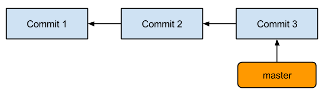
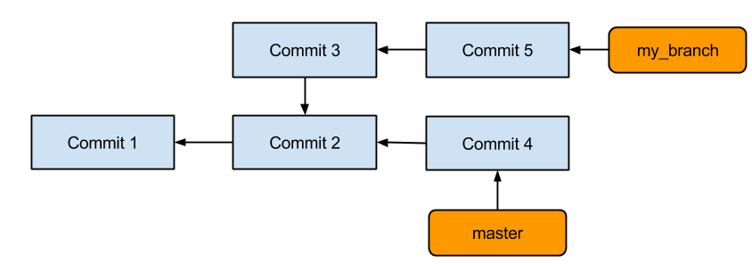
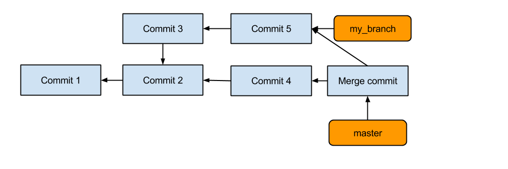
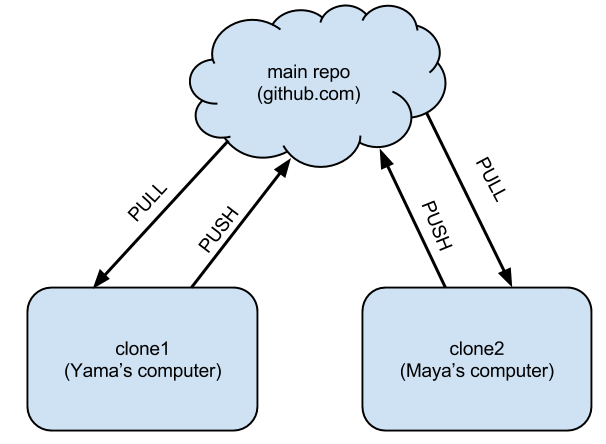
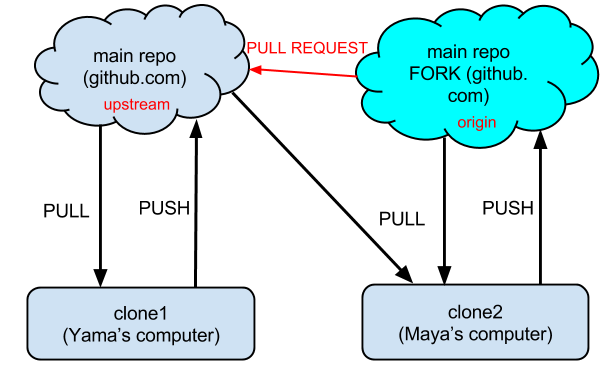

---
jupyter:
  jupytext:
    text_representation:
      extension: .md
      format_name: markdown
      format_version: '1.2'
      jupytext_version: 1.3.2
  kernelspec:
    display_name: Python 3
    language: python
    name: python3
---

<!-- #region slideshow={"slide_type": "slide"} -->
An introduction to Git
======================

<center>
June 28, 2021
</center>

<center>
Department of Aerospace Engineering, IIT Bombay
</center>

<center>
Prabhu Ramachandran
</center>

<!-- #endregion -->

<!-- #region slideshow={"slide_type": "slide"} -->
Agenda
------

-   Introduction to git
-   Using github and collaborating
-   Workflows

<!-- #endregion -->

<!-- #region slideshow={"slide_type": "slide"} -->

Motivation
----------

<center>

</center>

<br/>
<br/>
<br/>
Credit: www.phdcomics.com

<!-- #endregion -->

<!-- #region slideshow={"slide_type": "slide"} -->

History
-------

-   VCS: Version Control Systems
-   RCS
-   CVS
-   SVN
-   Centralized repositories

<!-- #endregion -->

<!-- #region slideshow={"slide_type": "slide"} -->

Distributed VCS
---------------

-   Peer-to-Peer system
-   Darcs
-   Bitkeeper
-   Mercurial: hg
-   Monotone
-   Bazaar: bzr
-   Git

<!-- #endregion -->

<!-- #region slideshow={"slide_type": "slide"} -->

Collaboration
-------------

-   Sourceforge.net etc.
-   github/bitbucket etc.

<!-- #endregion -->

<!-- #region slideshow={"slide_type": "slide"} -->

Introduction to git
-------------------

- Version control
   -   save work
   -   review changes
   -   do not lose history
   -   share with others
   -   reduce mental burden

-   Distributed workflow
-   Requirement for modern software development!

<!-- #endregion -->

<!-- #region slideshow={"slide_type": "slide"} -->


Basic model
-----------

-   A series of changesets (commits)
-   HEAD is the last commit

<!-- #endregion -->

<!-- #region slideshow={"slide_type": "slide"} -->


Getting started
---------------

Setup your details:

```bash
    $ git config --global user.name "Guru Programmer"
    $ git config --global user.email "your_email@youremail.com"
```

<!-- #endregion -->

<!-- #region slideshow={"slide_type": "slide"} -->

Create a repository
-------------------

Create a repo:

```bash
   $ cd my_project
   $ git init
```
Note that a `.git` directory is present!

<!-- #endregion -->

<!-- #region slideshow={"slide_type": "slide"} -->

Help!
-----

Find help:

```bash
    $ git help
    $ git help status
```

<!-- #endregion -->


<!-- #region slideshow={"slide_type": "slide"} -->

Status
------

Helpful status of repository:

```bash
    $ git status
```

Often provides hints

<!-- #endregion -->

<!-- #region slideshow={"slide_type": "slide"} -->

Basic commands
--------------

Add a file:

```bash
    $ vim readme.txt
    $ git add readme.txt
    $ git status
    $ git commit
```

<!-- #endregion -->

<!-- #region slideshow={"slide_type": "slide"} -->

Changing the default editor
---------------------------

`commit` will use `$EDITOR`. Change this with:

```bash
    $ export EDITOR="emacs -q -nw"
    $ export EDITOR=nano
```

Or :

```bash
    $ git config --global core.editor "emacs -q -nw"
```

<!-- #endregion -->

<!-- #region slideshow={"slide_type": "slide"} -->

A note on commit logs
---------------------
Here is an example:

    First line brief <= 50 chars

    Detailed information below. Ideally wrapped to 72 cols as done
    here.

    - ALWAYS leave a good log message.
    - Bullet points are fine.
    - Multiple paras separated by blank line.

<!-- #endregion -->

<!-- #region slideshow={"slide_type": "slide"} -->

Review history
--------------

What happened:

```bash
    $ git log
```

- Note the commit \"ID\"
- These are unique IDs

<!-- #endregion -->

<!-- #region slideshow={"slide_type": "slide"} -->

Notes
-----

- What happens when you commit?
- What happens when you add?
- The staging area
- New files always must be added
- Remember to `git add`!


<!-- #endregion -->

<!-- #region slideshow={"slide_type": "slide"} -->

Making changes
--------------

Make changes:

```bash
    $ vim readme.txt
    $ git status
    $ git diff
    $ git add readme.txt
    $ git commit
```

<!-- #endregion -->

<!-- #region slideshow={"slide_type": "slide"} -->

Some useful options
-------------------

- Add all changed files and commit:

```bash
    $ git commit -a
```

Commit log on command line:

```bash
    $ git commit -m "Fix for bug #123"
```

See changes in log:

```bash
    $ git log -p
```

<!-- #endregion -->

<!-- #region slideshow={"slide_type": "slide"} -->

Exercise
--------

1.  Create a dummy repo.
2.  Add some files.
3.  Make different changes and commit them.
4.  Review the log.

<!-- #endregion -->

<!-- #region slideshow={"slide_type": "slide"} -->

History
-------

- `HEAD` is the latest
- `HEAD~1`, `HEAD~2` is one/two changes before
- You can use the commit IDs (or a unique substring)

```bash

    $ git diff HEAD~1 readme.txt
    $ git diff 737e86dd9 readme.txt
```

Differences between two points:

```bash
    $ git diff HEAD~2..HEAD~4 readme.txt
```

<!-- #endregion -->

<!-- #region slideshow={"slide_type": "slide"} -->

Recovering old versions
-----------------------

Get the previous version:

```bash
    $ git checkout HEAD~1 readme.txt
```

Same rules as before apply

<!-- #endregion -->

<!-- #region slideshow={"slide_type": "slide"} -->

Ignoring files
--------------

- Add a `.gitignore`

```
    *.dat
    *.out
    *.pyc
```

Ignores all files with these extensions

<!-- #endregion -->

<!-- #region slideshow={"slide_type": "slide"} -->

Being Lazy: Aliases
-------------------

Convenient shorthand:

```bash
    $ git config --global alias.st status
    $ git config --global alias.ci 'commit -v'
    $ git config --global alias.co checkout
```

See `~/.gitconfig` for details:

```bash
    $ git st
    $ git ci
    $ git co
```

<!-- #endregion -->

<!-- #region slideshow={"slide_type": "slide"} -->
Recap
-----

- `git config`
- `git init`
- `git status`
- `git add`
- `git commit`
- `git diff`
- `git log`
- `git checkout`
- `.gitignore`: ignore files

<!-- #endregion -->

<!-- #region slideshow={"slide_type": "slide"} -->
Deleting content
----------------

Removing a file:

```bash
    $ git rm readme.txt
    $ git commit -m "Cleaning up"
```

-   Does the file go away?
-   Can you get back the file?

<!-- #endregion -->

<!-- #region slideshow={"slide_type": "slide"} -->
Exercise
--------

1.  Add a file with a few additional changes.
2.  Remove it.
3.  Make other changes to other files.
4.  Revive the deleted file.

<!-- #endregion -->

<!-- #region slideshow={"slide_type": "slide"} -->
Undoing
-------

Deleted too quick:

```bash
    $ git rm readme.txt
    # Oops made a mistake.
    $ git checkout -- readme.txt
```

Phew! Saved!

<!-- #endregion -->

<!-- #region slideshow={"slide_type": "slide"} -->
Moving content
--------------

Moving stuff:

```bash
    $ git mv readme.txt README.txt
    $ git commit -m "Renaming readme."
```

<!-- #endregion -->

<!-- #region slideshow={"slide_type": "slide"} -->
Some internals
--------------

- A series of changesets (commits)
- Blobs: a bunch of bytes
- Tree:
   - Collection of blobs
   - Other trees

- Commits:
   - Information on who committed it
   - Points to a tree
   - Parent to this commit.

- Tag:
   - A reference to a specific commit

<!-- #endregion -->

<!-- #region slideshow={"slide_type": "slide"} -->
Branches
--------

- Why branches?

   - Cheap, super-convenient
   - Allow experimentation

<!-- #endregion -->

<!-- #region slideshow={"slide_type": "slide"} -->
Simple repository
-----------------

This is what we had so far



<!-- #endregion -->

<!-- #region slideshow={"slide_type": "slide"} -->
Branches
--------



-   Can commit on either branch

<!-- #endregion -->

<!-- #region slideshow={"slide_type": "slide"} -->
Branch basics
-------------

- `master` is the default branch
- Create:
```bash
  $ git checkout -b new_branch
```
- List branches:
```bash
  $ git branch
```
- Note `branch` branches from current branch

<!-- #endregion -->

<!-- #region slideshow={"slide_type": "slide"} -->
More branch commands
--------------------

- Switch:

```bash
      $ git checkout master
      $ git checkout new_branch
```
- Delete:

```bash
      $ git branch -d new_branch
```

<!-- #endregion -->

<!-- #region slideshow={"slide_type": "slide"} -->
Merging branches
----------------

- Merge changes from `new_branch` to `master`:

```bash
      [new_branch] $ git checkout master
      [master] $ git merge new_branch
```
- Always merges to current branch
- Adds the changes from that branch to current one

<!-- #endregion -->

<!-- #region slideshow={"slide_type": "slide"} -->
What just happened?
-------------------



Let us take a look at `gitk` quickly

<!-- #endregion -->

<!-- #region slideshow={"slide_type": "slide"} -->
Exercise
--------

1.  Create a new branch.
2.  Add some commits there (add files, edit files \...)
3.  Check the logs on new branch and master
4.  Merge the branch to master.
5.  Delete the new branch.
6.  Check logs again.

HW: Try to delete an unmerged branch.

<!-- #endregion -->

<!-- #region slideshow={"slide_type": "slide"} -->
What if there are conflicts?
----------------------------

-   Merges can lead to conflicts:

```bash
        [master] $ git merge foo
        Auto-merging readme.txt
        CONFLICT (content): Merge conflict in readme.txt
```
-   Edit `readme.txt` and resolve conflicts

<!-- #endregion -->

<!-- #region slideshow={"slide_type": "slide"} -->
Resolving conflicts
-------------------

-   Look for lines like so:

        <<<<<<< HEAD
        Line in master
        =======
        Same line in my_branch
        >>>>>>> my_branch

-   Edit and remove the markers and:

```bash
    $ git add readme.txt
    $ git ci
```

<!-- #endregion -->

<!-- #region slideshow={"slide_type": "slide"} -->
Recap
-----

-   new branch: `git checkout -b new_branch`
-   switch: `git checkout master`
-   list: `git branch`
-   merge: `git merge new_branch`
-   delete: `git branch -d new_branch`

<!-- #endregion -->

<!-- #region slideshow={"slide_type": "slide"} -->
Recap
-----

- Conflicts:
   - Manually fix files
   - Remove markers
   - Add and commit

<!-- #endregion -->

<!-- #region slideshow={"slide_type": "slide"} -->
Collaborating
-------------

- github.com
- gitlab.com
- bitbucket.org
- etc.
- Provide hosting for a git repository
- Plus other powerful features

<!-- #endregion -->

<!-- #region slideshow={"slide_type": "slide"} -->
Collaboration Overview
----------------------

<center>

</center>

<!-- #endregion -->

<!-- #region slideshow={"slide_type": "slide"} -->
Basic ideas
-----------

- `clone` the entire repository
- `pull` changes from server
- `push` changes to server
- Share content with other users

<!-- #endregion -->

<!-- #region slideshow={"slide_type": "slide"} -->
Local demo
----------

- The principles can be demonstrated without a server!
- Consider two users:
   1.  Alice
   2.  Bob

- Make a server-like repository:
```bash
    $ mkdir -p server/project
    $ git init --bare
    $ cd ../../
```
<!-- #endregion -->

<!-- #region slideshow={"slide_type": "slide"} -->
Quick demo: Bob
---------------

Bob:
```bash
    $ mkdir bob
    $ git clone ../../server/project
```
Goes to sleep

<!-- #endregion -->

<!-- #region slideshow={"slide_type": "slide"} -->
Quick demo: Alice
-----------------

Alice:
```bash
    $ mkdir alice
    $ git clone ../../server/project
    $ touch readme.txt
    $ git add readme.txt
    $ git ci -a -m "Initial commit"
    $ git push origin master
```
<!-- #endregion -->

<!-- #region slideshow={"slide_type": "slide"} -->
Bob next morning
----------------

Bob (yawn):

```bash
    $ git pull
    $ git pull origin master
    $ add/commit whatever.
    $ git push origin master
```
<!-- #endregion -->

<!-- #region slideshow={"slide_type": "slide"} -->
Working together
----------------

- Lets say both Bob and Alice make changes but Alice pushes first
- Git will refuse to allow Bob to `push` his changes
- So Bob will first pull:

```bash
      [bob] $ git pull origin master
```
- Resolves any conflicts
- Then Bob can push his changes

<!-- #endregion -->

<!-- #region slideshow={"slide_type": "slide"} -->
# Recap
-----

<center>

</center>

<!-- #endregion -->

<!-- #region slideshow={"slide_type": "slide"} -->
Working with remote repos
-------------------------

Clone a repo:

```bash
    $ git clone https://github.com/FOSSEE/sees.git
```

Pulling changes (merges into current branch):

```bash
    $ git pull
    $ git pull origin master
```

Fetch only gets changes, it doesn\'t merge it:

```bash
    $ git fetch
```
<!-- #endregion -->

<!-- #region slideshow={"slide_type": "slide"} -->
Remotes
-------

- The name `origin` is called a **remote**
- A shorthand to refer to a repo
- One can add additional remotes

  - remote is a name for another fork/repo
  - You could pull/push to these remotes

- See `.git/config`

<!-- #endregion -->

<!-- #region slideshow={"slide_type": "slide"} -->
Sharing
-------

- Share your changes by pushing:
```bash
   $ git push origin master
```

- To push a branch you have made:
```bash
   $ git push origin my_branch
```
<!-- #endregion -->

<!-- #region slideshow={"slide_type": "slide"} -->
Permissions
-----------

- You cannot write to every repository!
- So how do you contribute?
- "FORK" the repository
   - This makes a clone of repo on github
   - You have write access to your fork

<!-- #endregion -->

<!-- #region slideshow={"slide_type": "slide"} -->
Forking
-------

<center>

</center>

<!-- #endregion -->

<!-- #region slideshow={"slide_type": "slide"} -->
Pull-requests
-------------

<center>

</center>

<!-- #endregion -->

<!-- #region slideshow={"slide_type": "slide"} -->
Contributing to another project
-------------------------------

- You cannot write to every repository!
- **Fork** their repository:
   - Makes a copy of their repo on github
   - This is your repo so you can share it

- Push to your fork
- Pull master of upstream
- Send a pull-request to upstream

<!-- #endregion -->

<!-- #region slideshow={"slide_type": "slide"} -->
Pull-requests (PR)
------------------

- Fantastic for sharing code
- Easy to review/get feedback/change
- Process:
   - Make a branch locally
   - Push to your fork (typically)
   - Select branch on bitbucket
   - "Create pull request"
   - target PR to reponame/master

<!-- #endregion -->

<!-- #region slideshow={"slide_type": "slide"} -->
Managing remotes
----------------

Add new remotes:

```bash
    $ git remote add <name> <server>
```
for example:

```bash
    $ git remote add fossee git@github.com:FOSSEE/sees.git
    $ git pull fossee some_branch
```
See remotes already defined:

```bash
    $ git remote -v
```
<!-- #endregion -->

<!-- #region slideshow={"slide_type": "slide"} -->
Managing remotes
----------------

Renaming:

```bash
    $ git remote rename origin upstream
```

Delete a remote branch:

```bash
    $ git br -d branch_to_delete # deletes it locally

    # This deletes the branch on the server.
    $ git push origin :branch_to_delete
```

<!-- #endregion -->

<!-- #region slideshow={"slide_type": "slide"} -->
Example: simple workflow
------------------------

- Single developer with repo on github:

```bash
      $ git add readme.txt
      $ git commit
      $ git push origin master
      ...
```
<!-- #endregion -->

<!-- #region slideshow={"slide_type": "slide"} -->
Example: two developers
-----------------------

- Two developers collaborating on github
- Same as Alice and Bob:

```bash
      [alice] $ git pull origin master
      [alice] $ git add readme.txt
      [alice] $ git commit
      [alice] $ git push origin master
      ...
      [bob] $ git pull origin master
      [bob] $ vim readme.txt
      [bob] $ git commit -a -m "Update readme"
      [bob] $ git push origin master
```
<!-- #endregion -->

<!-- #region slideshow={"slide_type": "slide"} -->
Example: contribute to project
------------------------------

1.  Fork their repo on github
2.  Clone *your* fork (origin)
3.  `git remote add https://.../sees upstream`
4.  Make branch locally
5.  Add changes to branch
6.  Push branch to origin
7.  Send PR to upstream

<!-- #endregion -->

<!-- #region slideshow={"slide_type": "slide"} -->
Odds and ends: `add -p`
----------------------

Adding only parts of changes "hunks"

```bash
    $ git add -p
    $ git commit
```
<!-- #endregion -->

<!-- #region slideshow={"slide_type": "slide"} -->
Odds and ends: `stash`
----------------------

Stashing lets you stow your changes away without commiting:

```bash
    $ git stash list
    $ git stash
    $ git stash pop
```
<!-- #endregion -->

<!-- #region slideshow={"slide_type": "slide"} -->
More git resources
------------------

- Software carpentry lessons http://software-carpentry.org/v5/novice/git/index.html

- Bitbucket tutorials:

   - https://www.atlassian.com/git/
   - https://www.atlassian.com/git/tutorial

- Newbie/Github:

   - http://readwrite.com/2013/09/30/understanding-github-a-journey-for-beginners-part-1

   - http://readwrite.com/2013/10/02/github-for-beginners-part-2
   - https://help.github.com/

- Quick: http://rogerdudler.github.io/git-guide/

<!-- #endregion -->
