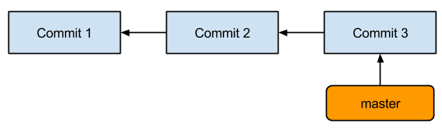
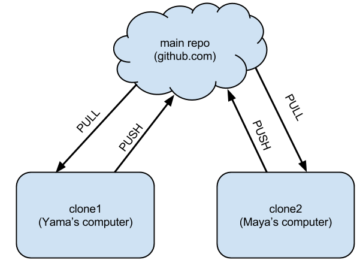
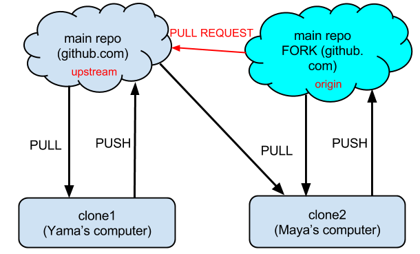

=============================================
An introduction to Git
=============================================

.. class:: center

    January 7, 2015

    Department of Aerospace Engineering,
    IIT Bombay

    :Author: Prabhu Ramachandran

Agenda
=========

- Introduction to git

- Using github and collaborating

- Workflows

Motivation
==================

.. image:: img/phd101212s.gif
    :scale: 50%
    :align: center

Credit: www.phdcomics.com

History
=========

- VCS: Version Control Systems

- RCS
- CVS
- SVN
- Centralized repositories

Distributed VCS
==================

- Peer-to-Peer system

- Darcs
- Bitkeeper
- Mercurial: hg
- Monotone
- Bazaar: bzr
- Git

Collaboration
===============

- Sourceforge.net etc.
- github/bitbucket etc.

Introduction to git
======================

- Version control
    - save work
    - review changes
    - do not lose history
    - share with others
    - reduce mental burden

- Distributed workflow

- Requirement for modern software development!

Basic model
=============

- A series of changesets (commits)
- HEAD is the last commit

Getting started
=================

Setup your details::

    $ git config --global user.name "Guru Programmer"
    $ git config --global user.email "your_email@youremail.com"

Create a repository
====================

Create a repo::

    $ cd my_project
    $ git init

Note that a ``.git`` directory is present!

Help!
========

Find help::

    $ git help
    $ git help merge

Status
========

Helpful status of repository::

    $ git status

Often provides hints

Basic commands
=================

Add a file::

    $ vim readme.txt
    $ git add readme.txt
    $ git status
    $ git commit

Changing the default editor
=============================

``commit`` will use ``$EDITOR``.  Change this with::

    $ export EDITOR="emacs -q"
    $ export EDITOR=nano

Or ::

    $ git config --global core.editor "emacs -q"

A note on commit logs
=======================

::

    First line brief <= 50 chars

    Detailed information below. Ideally wrapped to 72 cols.

    - ALWAYS leave a good log message.

    - Bullet points are fine.

    - Multiple paras separated by blank line.

Review history
================

What happened::

    $ git log

- Note the commit "ID"
- These are unique IDs

Notes
======

- What happens when you commit?
- What happens when you add?
- The staging area
- New files always must be added
- Remember to ``git add``!

Making changes
===================

Make changes::

    $ vim readme.txt
    $ git status
    $ git diff
    $ git add readme.txt
    $ git commit

Some useful options
====================

- Add all changed files and commit::

    $ git commit -a

Commit log on command line::

    $ git commit -m "Fix for bug #123"

See changes in log::

    $ git log -p

Exercise
=========

1. Create a dummy repo.
2. Add some files.
3. Make different changes and commit them.
4. Review the log.

History
========

- ``HEAD`` is the latest
- ``HEAD~1``, ``HEAD~2`` is one/two changes before
- You can use the commit IDs (or a unique substring)

::

    $ git diff HEAD~1 readme.txt
    $ git diff 737e86dd9 readme.txt

Differences between two points::

    $ git diff HEAD~2..HEAD~4 readme.txt

Recovering old versions
=========================

Get the previous version::

    $ git checkout HEAD~1 readme.txt

Same rules as before apply

Ignoring files
================

- Add a ``.gitignore``

::

    *.dat
    *.out
    *.pyc

Ignores all files with these extensions

Being Lazy: Aliases
=====================

Convenient shorthand::

    $ git config --global alias.st status
    $ git config --global alias.ci 'commit -v'
    $ git config --global alias.co checkout

See ``~/.gitconfig`` for details::

    $ git st
    $ git ci
    $ git co

Recap
========

- ``git config``
- ``git init``
- ``git status``
- ``git add``
- ``git commit``
- ``git diff``
- ``git log``
- ``git checkout``

- ``.gitignore``: ignore files

Deleting content
=================

Removing a file::

    $ git rm readme.txt
    $ git commit -m "Cleaning up"

- Does the file go away?
- Can you get back the file?

Exercise
=========

1. Add a file with a few additional changes.
2. Remove it.
3. Make other changes to other files.
4. Revive the deleted file.

Undoing
=========

Deleted too quick::

    $ git rm readme.txt
    # Oops made a mistake.
    $ git checkout -- readme.txt

Phew! Saved!

Moving content
===============

Moving stuff::

    $ git mv readme.txt README.txt
    $ git commit -m "Renaming readme."

Some internals
==================

- A series of changesets (commits)

- Blobs: a bunch of bytes
- Tree
    - Collection of blobs
    - Other trees
- Commits:
    - Information on who committed it
    - Points to a tree
    - Parent to this commit.
- Tag:
    - A reference to a specific commit

Branches
==========

- Why branches?
    - Cheap, super-convenient
    - Allow experimentation

Simple repository
===================

This is what we had so far

Branches
==========

.. image:: img/git_branch.png
    :align: center

- Can commit on either branch

Branch basics
==============

- ``master`` is the default branch

- Create::

    $ git checkout -b new_branch

- List branches::

    $ git branch

- Note ``branch`` branches from current branch

More branch commands
======================

- Switch::

    $ git checkout master
    $ git checkout new_branch

- Delete::

    $ git branch -d new_branch

Merging branches
=================

- Merge changes from ``new_branch`` to ``master``::

    [new_branch] $ git checkout master
    [master] $ git merge new_branch

- Always merges to current branch
- Adds the changes from that branch to current one

What just happened?
=====================

.. image:: img/git_branch_merge.png
    :align: center

Let us take a look at ``gitk`` quickly

Exercise
=========

1. Create a new branch.
2. Add some commits there (add files, edit files ...)
3. Check the logs on new branch and master
4. Merge the branch to master.
5. Delete the new branch.
6. Check logs again.

HW: Try to delete an unmerged branch.

What if there are conflicts?
==============================

- Merges can lead to conflicts::

    [master] $ git merge foo
    Auto-merging readme.txt
    CONFLICT (content): Merge conflict in readme.txt

- Edit ``readme.txt`` and resolve conflicts

Resolving conflicts
=====================

- Look for lines like so::

    <<<<<<< HEAD
    Line in master
    =======
    Same line in my_branch
    >>>>>>> my_branch

- Edit and remove the markers and::

    $ git add readme.txt
    $ git ci

Recap
======

- new branch: ``git checkout -b new_branch``
- switch: ``git checkout master``
- list: ``git branch``
- merge: ``git merge new_branch``
- delete: ``git branch -d new_branch``

Recap
======

- Conflicts:
    - Manually fix files
    - Remove markers
    - Add and commit

Collaborating
===============

- github.com
- bitbucket.org
- etc.
- Provide hosting for a git repository
- Plus other powerful features

Collaboration Overview
========================

Basic ideas
=============

- ``clone`` the entire repository
- ``pull`` changes from server
- ``push`` changes to server
- Share content with other users

Local demo
===========

- The principles can be demonstrated without a server!

- Consider two users:
    1. Alice
    2. Bob

- Make a server-like repository::

    $ mkdir -p server/project
    $ git init --bare
    $ cd ../../

Quick demo: Bob
===================

Bob::

    $ mkdir bob
    $ git clone ../../server/project

Goes to sleep

Quick demo: Alice
=======================

Alice::

    $ mkdir alice
    $ git clone ../../server/project
    $ touch readme.txt
    $ git add readme.txt
    $ git ci -a -m "Initial commit"
    $ git push origin master

Bob next morning
==================

Bob (yawn)::

    $ git pull
    $ git pull origin master
    $ add/commit whatever.
    $ git push origin master

Working together
=================

- Lets say both Bob and Alice make changes but Alice pushes first

- Git will refuse to allow Bob to ``push`` his changes

- So Bob will first pull::

    [bob] $ git pull origin master

- Resolves any conflicts

- Then Bob can push his changes

Recap
==========

Working with remote repos
==============================

Clone a repo::

    $ git clone https://github.com/FOSSEE/SDES2015.git

Pulling changes (merges into current branch)::

    $ git pull
    $ git pull origin master

Fetch only gets changes, it doesn't merge it::

    $ git fetch

Remotes
========

- The name ``origin`` is called a "remote"

- A shorthand to refer to a repo

- One can add additional "remotes"

    - remote is a name for another fork/repo
    - You could pull/push to these remotes

- See ``.git/config``

Sharing
============

- Share your changes by pushing::

    $ git push origin master

- To push a branch you have made::

    $ git push origin my_branch

Permissions
============

- You cannot write to every repository!

- So how do you contribute?

- "FORK" the repository

    - This makes a clone of repo on github
    - You have write access to your fork

Forking
==========

Pull-requests
=========================

Contributing to another project
=================================

- You cannot write to every repository!

- **Fork** their repository:
    - Makes a copy of their repo on github
    - This is your repo so you can share it

- Push to your fork

- Pull master of upstream

- Send a pull-request to upstream

Pull-requests (PR)
=======================

- Fantastic for sharing code

- Easy to review/get feedback/change

- Process:
    - Make a branch locally
    - Push to your fork (typically)
    - Select branch on bitbucket
    - "Create pull request"
    - target PR to pysph/master

Managing remotes
==================

Add new remotes::

    $ git remote add <name> <server>

for example::

    $ git remote add fossee git@github.com:FOSSEE/SDES2015.git
    $ git pull fossee some_branch

See remotes already defined::

    $ git remote -v

Managing remotes
==================

Renaming::

    $ git remote rename origin upstream

Delete a remote branch::

    $ git br -d branch_to_delete # deletes it locally

    # This deletes the branch on the server.
    $ git push origin :branch_to_delete

Example: simple workflow
===========================

- Single developer with repo on github::

    $ git add readme.txt
    $ git commit
    $ git push origin master
    ...

Example: two developers
===========================

- Two developers collaborating on github
- Same as Alice and Bob::

    [alice] $ git pull origin master
    [alice] $ git add readme.txt
    [alice] $ git commit
    [alice] $ git push origin master
    ...
    [bob] $ git pull origin master
    [bob] $ vim readme.txt
    [bob] $ git commit -a -m "Update readme"
    [bob] $ git push origin master

Example: contribute to project
===============================

1. Fork their repo on github
2. Clone *your* fork (origin)
3. ``git remote add https://.../SDES.git upstream``
4. Make branch locally
5. Add changes to branch
6. Push branch to origin
7. Send PR to upstream

Odds and ends: ``stash``
=========================

Stashing lets you stow your changes away without commiting::

    $ git stash list
    $ git stash
    $ git stash pop

More git resources
=======================

 - Software carpentry lessons:
    - http://software-carpentry.org/v5/novice/git/index.html

 - Bitbucket tutorials:
    - https://www.atlassian.com/git/
    - https://www.atlassian.com/git/tutorial

 - Newbie/Github:
    - http://readwrite.com/2013/09/30/understanding-github-a-journey-for-beginners-part-1
    - http://readwrite.com/2013/10/02/github-for-beginners-part-2
    - https://help.github.com/

 - Quick:
    - http://rogerdudler.github.io/git-guide/
