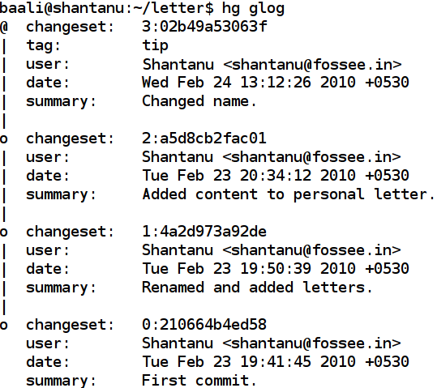
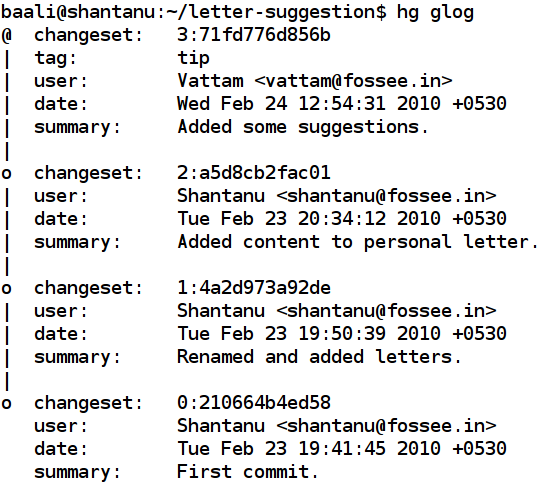
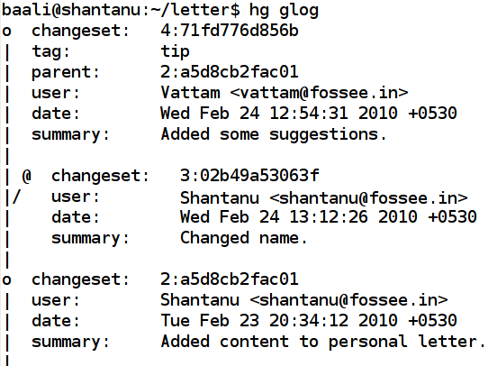
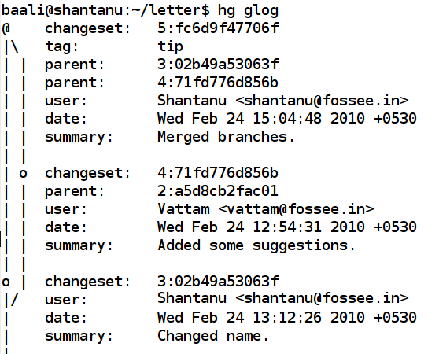
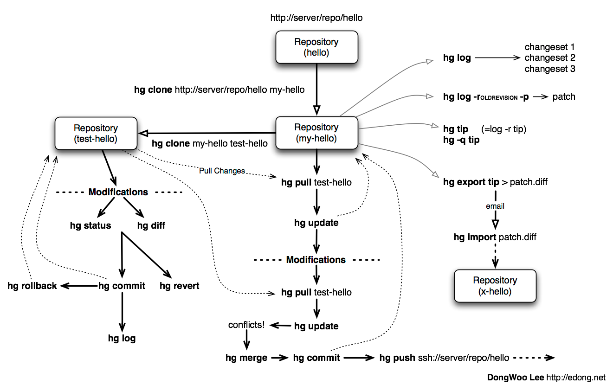

===============
Version Control
===============

Introduction
============

The following statement from a blog[1](http://karlagius.com/2009/01/09/version-control-for-the-masses/") aptly points usefulness of version control systems:

"Version control is one of those weird, geeky things that never really gained much ground in non-geek fields, despite the fact that it’s blindingly useful.

Version control (or source control) is nothing more complex than keeping copies of work as we make changes. On the surface, it’s all straight-forward; make a copy of every file before making any changes to it. That way, if something seriously messes up, one can always fall back to something that worked before, or at least compare the broken copy with one that used to work so one can figure out where it went wrong."

One probably cooks up their own version control system without realizing it had such a geeky name. For instances files with names oldxxxxxx.py and latestxxxxxx.py. Every time to make some change in a file, one save it with different name then the original one. Luckily there are like, loads of version control systems out there to do this heavy lifting.

Why Use Version Control
=======================
 
One of idea behind Version Control Tools was to build onto very first step which can be creating a empty file, or writing a first buggy program for assignment, rather than simply loose it. So here are some more reasons why is automated version control needed:

    - It will track the history and evolution of a project, so one don't have to do it manually. It allows to track what changes where made, when were they made, by whom and why.
    - For a team of people working on same project, revision control software makes it easier to collaborate. For example, when people more or less simultaneously make potentially incompatible changes, the software will help them to identify and resolve those conflicts.
    - It can help to recover from mistakes. If a change made at some moment of time, turns out to be an error in future, one can revert to an earlier version of one or more files. In fact, a really good revision control tool will even help in efficiently figure out exactly when a problem was introduced.

Most of these reasons are equally valid for the project having one man show, or hundred people. Besides projects, even it can be used to maintain assignments related to one particular subject/course, it will help manage things in way much better way. These tools can be used for better *resources management*. All codes, documents, presentation, assignments related to one course maintained in such a inventory can help avoiding accidental lose of data(deletion) and Internet hosting for version control will make the work immune to local hard-disk crash.

Some of Version Control Tools available and used widely are:

     - cvs (Concurrent Version System)
     - svn (Subversion)
     - hg (Mercurial)
     - bzr (Bazaar)
     - git 

Each of above mentioned tools have sets of feature which it offers in unique way. For this session we are going to concentrate on hg (mercurial). After covering the basics of hg, one can easily try other tools, and use what-ever he/she is most comfortable with.

Learning the Lingo
==================

Here are some of terms which are going to used through out the rest of session:

Basic Setup
-----------

(should we include at all terms used by vcs's other than hg?)

     Repository(repo):
	The folder with all the files.
     Server:
	The system with the main(mother) repo.
     Trunk/Main:
	The “primary” location for code in the repo. Think of code as a family tree — the “trunk” is the main line. This is generally what is present on server.

Basic Actions
-------------
     
     Add:
	Put a file into the repo for the first time, i.e. begin tracking it with Version Control.
     Head/Tip:
	The latest version of the repo(Die Hard 4.1)
     Revision:
	What version a file is on.
     Clone:
     	Creating initial copy of the repo onto a local machine.
     Commit:
     	Committing the changes done to the repo in terms of contents of the files or adding/removing of the files.
     Logs/History:
	Logs of all the past changes done to the repo.
     Update:
        Updating the local repo with the main one, includes both, adding changing done by us or importing changes done by others.
     Revert:
        Going back to previous committed state of file.

Advanced Actions:
-----------------

     Branch:
	Create a separate copy of the repo for private use (bug fixing, testing, etc).
     Diff/Change:
	Finding the differences between two versions of a file.
     Merge (or patch):
     	Apply the changes from one branch to another, to bring it up-to-date.
     Conflict:
	When pending changes to a file contradict each other (both changes cannot be applied).
     
Types of Version Control:
-------------------------

(should we have this part at all?)
Based on how source/code management is carried out in a tool there are two categories of Version Control Systems(VCS):

      - Centralized VCS: 
      	In this kind of system all the revision control functions are performed on a shared server. If two developers try to change the same file at the same time, without some method of managing access the developers may end up overwriting each others work. Centralized revision control systems solve this problem in one of two different "source management models": file locking and version merging. Both svn and cvs follows this kind of management.
   
      - Distributed VCS:
      	In a distributed model, every developer has their own repo. Diffs, commits, and reverts are all done locally, one needs Internet only to share the changes with others. It makes work faster, handles branching and merging in better way, with less management. hg, bzr and git uses this work flow.

Get Going with Hg:
==================

Why hg?
-------

   - easy to learn and use.
   - lightweight.
   - scales excellently.
   - based on Python.

A small point to notice here, hg cant track binary files for changes, one can add them to repo, but wont be able to track changes made to it. And hg considers, odt, pdf files as binary.

Installation:
-------------

- For Linux based systems, hg is available in most of package management. So for say Ubuntu systems::

   $ sudo apt-get install mercurial

  will be all you need to install hg. Similarly Fedora users can use yum to install hg. 

- For Windows and Mac OS X systems the setup can be downloaded from http://mercurial.selenic.com/downloads/ and standard installation can be followed.

Getting Started:
----------------

After installation is complete lets get started with using. First things first, lets pay our homage to *man* pages as per rituals: ::
   
   $ man hg

This will give us manuscript of all the options available with *hg*. We can either look through all of it, or a better way will be to use built-in help system of *hg*. Say to get brief list of all commands, along with a description of what each does we can use ::

   $ hg help

   Mercurial Distributed SCM
   list of commands:
   add          add the specified files on the next commit
   addremove	-----------------------
   ------------------------------------
   heads        show current repository heads or show branch heads
   ------------------------------------

For specific command, just follow the command name after the help. ::

    $ hg help diff
    hg diff [OPTION]... [-r REV1 [-r REV2]] [FILE]...

    diff repository (or selected files)
    Show differences between revisions for the specified files.
    Differences between files are shown using the unified diff format.
    NOTE:____________

Let there be Repository:
------------------------

In Mercurial, everything happens inside a repository. The repository for a project contains all of the files that “belong to” that project, along with a historical record of the project's files. A repository is simply a directory which Mercurial treats as special.

There can be two ways to create a repo, either downloading a copy of existing repo available on Internet, or creating/starting a new repo. 

Say we have a directory which we want to bring under version control, so we start a new repository using *hg init*: ::

  $ ls -a circulate/
  .  ..  lena.png  pendulum.txt  points.txt  pos.txt  sslc1.py  sslc1.txt
  $ cd circulate/
  $ hg init
  $ ls -a
  .  ..  .hg  lena.png  pendulum.txt  points.txt  pos.txt  sslc1.py  sslc1.txt

*.hg* directory indicates that this new dir is now a repo.This is where Mercurial keeps all of its metadata for the repository.The contents of the .hg directory and its subdirectories are private to Mercurial. Rest all files are for the user to use them as they pleases.

For getting already existing repo hg uses command *"clone"* ::

      $ hg clone http://hg.serpentine.com/tutorial/hello localCopyhello

      requesting all changes
      adding changesets
      adding manifests
      adding file changes
      added 5 changesets with 5 changes to 2 files
      updating working directory
      2 files updated, 0 files merged, 0 files removed, 0 files unresolved

If clone succeeded, there would be a local directory called localCopyhello, with some files: ::

      $ ls localCopyhello/
      hello.c  Makefile

Every Mercurial repository is complete, self-contained, and independent. It contains its own private copy of a project's files and history.

Creating a branch of existing local repo is very easy via hg using clone command: ::
	
     $ hg clone localCopyhello newCopy
    updating working directory
    2 files updated, 0 files merged, 0 files removed, 0 files unresolved

newCopy is exact copy of already existing repo. These local branches can prove really handy at times. It allows keep multiple copies of local branch for different purposes, say for debugging, testing, working version.
	
History or Logs:
----------------

For the new repo created, first thing which can be tried is to check the logs/history. What changes were made and when and why, answers to all those questions are stored in logs safely. So for the cloned repo the history can be viewed using command *"log"* (following commands are wrt localCopyhello repo). ::

    $ hg log
    changeset:   4:2278160e78d4
    tag:         tip
    user:        Bryan O'Sullivan <bos@serpentine.com>
    date:        Sat Aug 16 22:16:53 2008 +0200
    summary:     Trim comments.

    changeset:   3:0272e0d5a517
    user:        Bryan O'Sullivan <bos@serpentine.com>
    date:        Sat Aug 16 22:08:02 2008 +0200
    summary:     Get make to generate the final binary from a .o file.

    changeset:   2:fef857204a0c
    user:        Bryan O'Sullivan <bos@serpentine.com>
    date:        Sat Aug 16 22:05:04 2008 +0200
    summary:     Introduce a typo into hello.c.

    changeset:   1:82e55d328c8c
    user:        mpm@selenic.com
    date:        Fri Aug 26 01:21:28 2005 -0700
    summary:     Create a makefile

    changeset:   0:0a04b987be5a
    user:        mpm@selenic.com
    date:        Fri Aug 26 01:20:50 2005 -0700
    summary:     Create a standard "hello, world" program

By default, this command prints a brief paragraph of output for each change to the project that was recorded.The fields in a record of output from hg log are as follows:

   - changeset: This field is a identifier for the changeset. The hex string is a unique identifier.
   - user: The identity of the person who created the changeset.
   - date: The date and time on which the changeset was created.
   - summary: The first line of the text message entered to describe the changeset.

To narrow the output of hg log down to a single revision, use the -r option. ::
   
   $ hg log -r 3
   changeset:   3:0272e0d5a517
   user:        Bryan O'Sullivan <bos@serpentine.com>
   date:        Sat Aug 16 22:08:02 2008 +0200
   summary:     Get make to generate the final binary from a .o file.

*range notation* can be used to get history of several revisions without having to list each one. ::

   $  hg log -r 2:4
   changeset:   2:fef857204a0c
   user:        Bryan O'Sullivan <bos@serpentine.com>
   date:        Sat Aug 16 22:05:04 2008 +0200
   summary:     Introduce a typo into hello.c.

   changeset:   3:0272e0d5a517
   user:        Bryan O'Sullivan <bos@serpentine.com>
   date:        Sat Aug 16 22:08:02 2008 +0200
   summary:     Get make to generate the final binary from a .o file.

   changeset:   4:2278160e78d4
   tag:         tip
   user:        Bryan O'Sullivan <bos@serpentine.com>
   date:        Sat Aug 16 22:16:53 2008 +0200
   summary:     Trim comments.

-v option with "log" gives some extra details related to a changeset.

Making Changes:
---------------

Lets follow a simple exercise of *managing letters* using hg. We create a new directory and start revision tracking on it.::

  $  mkdir letter
  $  cd letter
  $  touch letter.tex
  $  hg init

Now lets try to create a local clone of this repository::

  $  hg clone letter letter-clone
  updating working directory
  0 files updated, 0 files merged, 
  0 files removed, 0 files unresolved 

So here, message says 0 files updated but we have just created a *tex* file inside it. Lets try to see status of our main repository by using *status(st)* command::

  $ cd letter  
  $ hg st
  ? letter.tex

"?" sign in front of file indicates that this file is alien to hg, as in we have to *add* it to repo by::

  $ hg add letter.tex
  $ hg st
  A letter.tex

So file is now part of repository(A symbol). We *commit (alias ci)* it to repo and make changes effective ::

   $ hg ci -u "Shantanu <shantanu@fossee.in>" 
        -m "First commit."
   $ hg log
   changeset:   0:210664b4ed58
   tag:         tip
   user:        Shantanu <shantanu@fossee.in>
   date:        Tue Feb 23 19:41:45 2010 +0530
   summary:     First commit.

Some arguments passed to *ci* command are worth noticing:
 - *u* is to provide name and email contact information of person making changes!
 - *m* is to provide one-line summary of changeset. 

If we don't give these options, *ci* will take us to a default editor, there we have to specify a commit *message* in first line, then we can edit other information like username, once done just exit the editor and changes are committed to the repo. Now these changes will be visible in logs.

Similar to add there are other commands available for file management in repo. *copy (alias cp)* command is used to mark files as copied for the next commit. ::

   $ hg cp letter.tex letter-prof.tex

*rename(alias mv)* rename files; equivalent of copy + remove. ::

   $ hg rename letter.tex letter-personal.tex
   $ hg st
   A letter-personal.tex
   A letter-pro.tex
   R letter.tex
   $ hg ci -u "Shantanu <shantanu@fossee.in>" -m "Renamed and added letters."
           
*tip* command shows newest revision in the repository. ::

   $ hg tip
   changeset:   1:4a2d973a92de
   user:        Shantanu <shantanu@fossee.in>
   date:        Tue Feb 23 19:50:39 2010 +0530
   summary:     Renamed and added letters.

Sharing Changes:
----------------

Pulling from repo:
~~~~~~~~~~~~~~~~~~

As mentioned earlier that repositories in Mercurial are self-contained. This means that the changeset just created exists only in *letter* repository and not in previously cloned . There are a few ways that can be used to propagate this change into other repositories. *pull* command will download all changeset from main repo. ::

   $ cd letter-clone
   $ hg pull 
   pulling from /home/baali/letter
   requesting all changes
   adding changesets
   adding manifests
   adding file changes
   added 2 changesets with 2 changes to 2 files
   (run 'hg update' to get a working copy)

*changeset* means a list of changes made to a file. In words of *hg help*, pull command is: ::

   pull changes from the specified source

   Pull changes from a remote repository to a local one.

   This finds all changes from the repository at the specified path
   or URL and adds them to the local repository. By default, this
   does not update the copy of the project in the working directory.

Some times, even before pulling changesets, one may need to see what changes would be pulled, Mercurial provides *hg incoming* to tell what changes *hg pull* would pull into repo, without actually pulling the changes. This command is really handy in case of avoiding unwanted changesets into the repo.

As output of *pull* command suggests it does not(by default) update the working directory. By update we mean, content of files and directory structure still remains the same as prior to *pull* command. *hg up (alias update)* command updates repo by adding latest imported changesets and bringing it upto date. ::

   $ ls -a
   .  ..  .hg
   $ hg up
   2 files updated, 0 files merged, 
   0 files removed, 0 files unresolved
   $ ls -a
   .  ..  .hg  letter-personal.tex  
   letter-pro.tex
    
To update to specific version, give a version number to the *hg update* command.

Making Changes:
~~~~~~~~~~~~~~~

Lets start with adding content to letters. For start personal letter can be a letter to ask a boy/girl out! Using LaTeX to write letter, it would be straight forward, open the file in any text editor and add the following content to it ::

  \documentclass{letter}
  \begin{document}
  \begin{letter}{}
  \opening{Hello xxxxxx,}
  I really enjoyed meeting you in CS 101, 
  but would love to know you better. 
  How about a coffee on Thursday after class?
  \closing{-xxxxx}
  \end{letter}
  \end{document}

Replace "xxxxx" with proper names to suite yourself. Mercurial's hg status command will tell us what Mercurial knows about the files in the repository. 'M' sign in front of feviStick.py indicates that Mercurial has noticed change(modified). ::

  $ hg st
  M letter-personal.tex

At times more information is needed on knowing exactly what changes were made to what files. To do this, use the *hg diff* command. ::

    $ hg diff
    diff -r 4a2d973a92de letter-personal.tex
    --- a/letter-personal.tex	Tue Feb 23 19:50:39 2010 +0530
    +++ b/letter-personal.tex	Tue Jun 08 16:12:19 2010 +0530
    @@ -0,0 +1,11 @@
    +\documentclass{letter}
    +\begin{document}
    + 
    +\begin{letter}{}
    +\opening{Hello Jas,}
    +  
    +I really enjoyed meeting you in CS 101, but would love to know you better. How about a coffee on Thursday after class?
    +
    +\closing{-Samarth}
    +\end{letter}
    +\end{document}
        
We can modify files, build and test our changes, and use hg status and hg diff to review our changes, until we're satisfied with what we've done and arrive at a natural stopping point where we want to record our work in a new changeset. All the diffs prior to committing the changes would be done wrt earlier marked record.Then we use *hg commit* to create a new changeset

Mercurial records your name and email-address with each change that you commit, so that you and others will later be able to tell who made each change. It also tries to automatically figure out a sensible username to commit the change with. When we try to use *hg commit* there are various ways by which one can specify User name, some of those are:
	  
	  - Specify a -u option to the hg commit command on the command line, followed by a username, this is the procedure we used earlier.
	  - set HGUSER environment variable::

	    $ export HGUSER="xxxxx"	  
	  - Edit hgrc file present in .hg folder to set this property, add following lines to that file and Mercurial will read those parameters from that location. ::
	  
		[ui]
		username = Firstname Lastname <email.address@example.net>

	    For me the hgrc file for *letter* clone repo looks like this: ::

	        [paths]
		default = /home/baali/letter
		[ui]	
		username = Shantanu Choudhary <shantanu@fossee.in>

Once this parameter is set, *hg commit* command drops us into a text editor, to enter a message that will describe the modifications we've made in this changeset. This is called the commit message. It will be a record for readers of what we did and why, and it will be printed by hg log after we've finished committing. ::

    Added content to personal letter.
    HG: Enter commit message.  Lines beginning with 'HG:' are removed.
    HG: --
    HG: user: Shantanu Choudhary <shantanu@fossee.in>
    HG: branch 'default'
    HG: changed letter-personal.tex

This would be your default system editor(for me it is vim, one can set it also), where you can enter the log message in first line, once you are done with log message quit the editor using *[ESC] key ":wq"*.Once we've finished the commit, we can use the hg tip command to display the changeset we just created. ::

    $ hg tip
    changeset:   2:a5d8cb2fac01
    user:        Shantanu <shantanu@fossee.in>
    date:        Tue Feb 23 20:34:12 2010 +0530
    summary:     Added content to personal letter.
    
One can do above mentioned procedure using following one line command: ::

    $ hg ci -u "Shantanu <shantanu@fossee.in>" -m "Added content to personal letter."

Sharing Changes:
~~~~~~~~~~~~~~~~

So now we have this *letter-clone* repo where we created above changes and committed them. But the main repo(*trunk*) that is *letter* wont be hinted of these changes. It will be still in older stage, same way as we pulled changes to this cloned repo from main branch at starting. To share changes from a cloned repo to main branch hg provides with *push* command. It is same as *pull* but instead of pulling it pushes the changes to trunk. ::

    $ hg push ../Fevicol
    pushing to ../Fevicol
    searching for changes
    adding changesets
    adding manifests
    adding file changes
    added 1 changesets with 1 changes to 1 files

Same as with hg pull, the hg push command populates the changesets nothing more. ::

   $ cd ../letter
   $ hg tip
   changeset:   2:a5d8cb2fac01
   user:        Shantanu <shantanu@fossee.in>
   date:        Tue Feb 23 20:34:12 2010 +0530
   summary:     Added content to personal letter.

The branch where changes are being pushed still need *up* to be updated or for inclusion of all the imported changesets ::

   $ hg up
   1 files updated, 0 files merged, 0 files removed, 0 files unresolved
   $ cat letter-personal.tex
   \documentclass{letter}
   \begin{document} 
   \begin{letter}{}
   \opening{Hello xxxx,}  
   I really enjoyed meeting you in CS 101, but would love to know you better. How about a coffee on Thursday after class?
 
   \closing{-xxxx}
   \end{letter}
   \end{document}

Merging the Work:
~~~~~~~~~~~~~~~~~

This is next aspect of any version control, how to merge work done by various participants of project in a way that no one looses changes being made, and still remains updated. Here is simple case study which can help understanding why merging is required: 

Two persons, A and B are contributing on same project. Both starts from cloning the same online repo(lets say present state X), so that both have a working local repo. Now A edits one of file, commits the changes and pushes to the repo, hence changing the state of repo to Y, but B, have not updated his repo, makes a change in one of files and reaches to a different state Z. Now when A pulls repo from B, his repo will have multiple heads. This stage is clearly ambiguous, the repo of A is not consistent, it has multiple heads, and from here, whatever changes he makes can take whatsoever direction if it is not fixed, and hence A will have to merge changes so that everything becomes consistent again.

Lets see how this work with working repo, we will use letter and letter-clone repositories created earlier. For now, the status of both repo is: ::

   $ cd letter-clone
   $ hg tip
   changeset:   2:a5d8cb2fac01
   user:        Shantanu <shantanu@fossee.in>
   date:        Tue Feb 23 20:34:12 2010 +0530
   summary:     Added content to personal letter.

We share(clones) this repo with a friend, he goes through the letter and just makes small change of adding color to clogins part of letter. ::

   $ hg diff
   diff -r 4a2d973a92de letter-personal.tex
   --- a/letter-personal.tex	Tue Feb 23 19:50:39 2010 +0530
   +++ b/letter-personal.tex	Wed Feb 24 12:03:33 2010 +0530
   @@ -0,0 +1,12 @@
   \documentclass{letter}
   +\usepackage{color}
   \begin{document}
   .
   -\closing{-Samarth}
   +\closing{\textcolor{red}{-Samarth}}

Here the "-" sign shows which lines are removed, and "+" indicates what lines are added. He is satisfied and commits the changes. ::

    $ hg ci -u "Vattam <vattam@fossee.in>" -m "Added some suggestions."   
    changeset:   3:71fd776d856b
    parent:      2:a5d8cb2fac01
    user:        Vattam <vattam@fossee.in>
    date:        Wed Feb 24 12:54:31 2010 +0530
    summary:     Added some suggestions.

In the meanwhile, it seems, our "xxxx" is already dating someone else. So we also change the name to "yyyy" who is available, and we commit it ::

    $ cd letter
    $ hg ci -u "Shantanu <shantanu@fossee.in>" -m "Changed name."
    $ hg tip
    changeset:   3:02b49a53063f
    user:        Shantanu <shantanu@fossee.in>
    date:        Wed Feb 24 13:12:26 2010 +0530
    summary:     Changed name.
    
So now we have two repo, who have different commit history and tree. 

If we try to pull changes from one to another, this is how it goes(we are still in letter repo): ::

    $ hg pull ../letter-suggestion
    pulling from ../letter-suggestion
    searching for changes
    adding changesets
    adding manifests
    adding file changes
    added 1 changesets with 1 changes to 1 files (+1 heads)
    (run 'hg heads' to see heads, 'hg merge' to merge)    

There we go, since both repo were on different track, hg pull command in last line gives some heading from here. *hg heads* command show current repository heads or show branch heads. ::

    $ hg heads 
    changeset:   4:71fd776d856b
    tag:         tip
    parent:      2:a5d8cb2fac01
    user:        Vattam <vattam@fossee.in>
    date:        Wed Feb 24 12:54:31 2010 +0530
    summary:     Added some suggestions.
    
    changeset:   3:02b49a53063f
    user:        Shantanu <Shantanu@fossee.in>
    date:        Wed Feb 24 13:12:26 2010 +0530
    summary:     Changed name.
    
To get better understanding of what is going on hg have a tool known as *glog* which shows revision history alongside an ASCII revision graph. ::
     
    $ hg glog

To bring repo on single track/branch once again we will have to merge these two branches. Without merging them even hg update wont work for obvious reason of confusing track record. ::

    $ hg up
    abort: crosses branches (use 'hg merge' or 'hg update -C')

*hg merge* command merge working directory with another revision. ::

    $ hg merge
    1 files updated, 0 files merged, 0 files removed, 0 files unresolved
    (branch merge, don't forget to commit)   

After merging two branches, until we commit the results of merge it will keep on showing two heads. ::

    $ hg ci -u "Shantanu <shantanu@fossee.in>" -m "Merged branches."
    $ hg glog 

*And we are back on track.*

Workflow:
=========

This is chain of steps which can be followed for working against a project that has a centralized copy, you may want to make sure you're up to date first. This means pulling its changes and then updating. 

For example: ::
    
    $ hg pull
    $ hg update

This will grab the remote changes from the location you first cloned from. Then it will apply the changes. You can do this in one go with: ::

    $ hg pull -u

Now let's say you make some changes. You edit a file and you want to commit your change. You can do this with: ::

    $ hg commit

An editor will pop-up asking you to write a message describing your change. When you're done for the day, and you have required changesets sitting in your repository. Before pushing to upstream make sure to pull and update and merge branches if required, once everything looks okay and you have single track, push the changes, ::

    $ hg push

Cheatsheet
==========

Suggested Reading:
==================

	* http://karlagius.com/2009/01/09/version-control-for-the-masses/
	* http://betterexplained.com/articles/a-visual-guide-to-version-control/
	* http://en.wikipedia.org/wiki/Revision_control
	* http://hgbook.red-bean.com/
	* http://betterexplained.com/articles/intro-to-distributed-version-control-illustrated/
	* http://wiki.alliedmods.net/Mercurial_Tutorial
